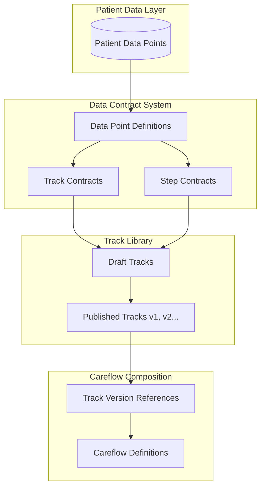
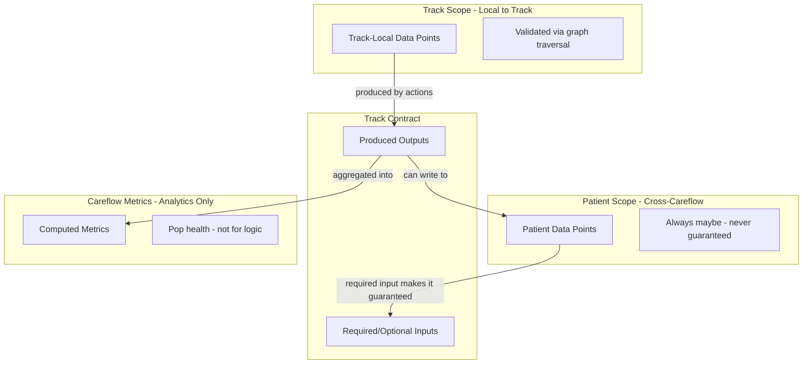
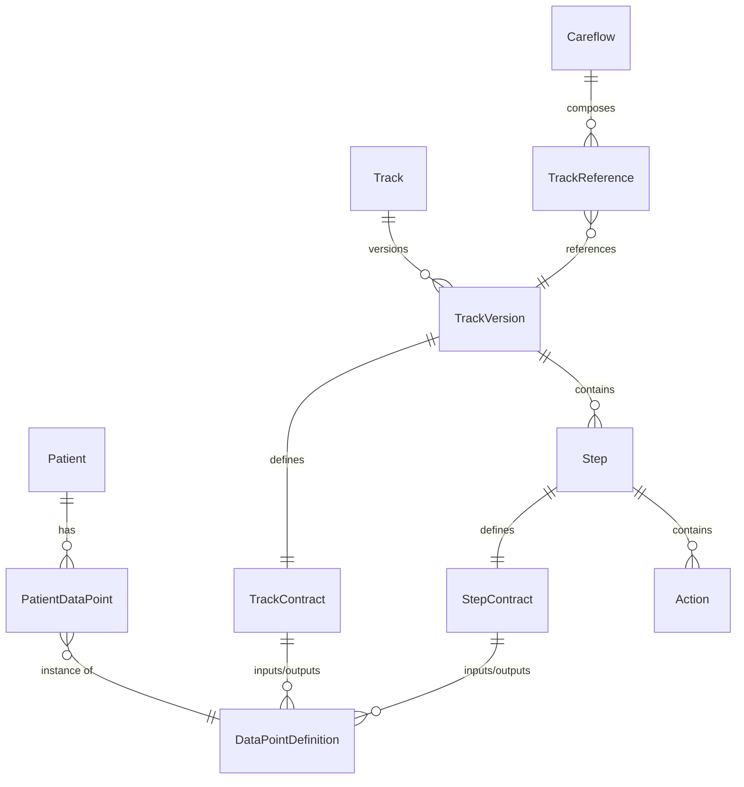

# Awell Studio Rebuild - Master Plan

## Current State Summary

The existing `app-pathway-studio` is a standalone React app (webpack/vite) that connects to `pathway-design` backend which uses:

- **Event sourcing with CQRS** - All state changes via commands/events/handlers
- **ArangoDB "design" database** - Event streams + component collections
- **GraphQL API** - type-graphql resolvers
- **Canvas** - `@awell/ui-kit` wrapping React Flow
- **Careflow-scoped data points** - No patient-level data, no track independence
- **Monolithic publishing** - Entire careflow published as unit, tracks not shareable

## Fundamental Architecture Shifts

The new architecture introduces three major paradigm changes:

### 1. Data-First Design

Data points are the foundational "contract language" that connects everything:

- **Patient-scoped data points**: Persist across all careflows for a patient. Always "maybe" available unless declared as required track input.
- **Track-scoped data points**: Local to the track execution. Can be validated via graph traversal (if you reference data in step 1 that's collected in step 3, that's a validation error).
- **Track contracts**: Explicit input/output declarations - inputs are what the track needs from patient data, outputs are what it produces.
- **Metrics (not data points)**: Careflow-level computed values useful for population health analytics, but NOT for driving careflow logic.

### 2. Track-First Authoring

Tracks are the primary versioned, publishable building blocks:

- Tracks have independent lifecycle (draft -> published -> versioned)
- Tracks can exist without belonging to any careflow
- Tracks can be shared across multiple careflows
- Careflows reference specific track versions (like npm dependencies)

```
Care flow A ──references──> Track A v1.0
                           Track B v2.1  <──references── Care flow B
                           Track D v1.3  <──references── Care flow B
Care flow B ──references──> Track C v1.0

Track E (standalone, not in any careflow)
```

### 3. Explicit Contracts Enable Validation

With declared inputs/outputs at track and step level:

- Validate that required inputs are satisfied before execution
- Know what will fail for triage purposes
- Enable AI agents to understand what a track needs/produces
- Enable track reuse with confidence

### 4. FHIR-Ready Without FHIR Knowledge

Track outputs can optionally be mapped to FHIR resources:

- **Careflows map to CarePlan** - A careflow is effectively a FHIR CarePlan
- **Track outputs can produce FHIR resources** - e.g., Observation, Condition, Procedure
- **Data points can map to FHIR elements** - e.g., a "blood_pressure" data point maps to Observation.value
- **Users don't need to know FHIR** - They define data points and optionally select a FHIR mapping from templates
- **Enables interoperability** - Output can be exported as valid FHIR bundles for EHR integration

## Target Architecture



## Data Model Overview

### Data Point Scopes



**Key Insight**: Within a track, we know ALL available data by traversing inbound from any node to the track start. If step 1 references data collected in step 3, validation catches it.

### Entity Relationships



## Key Architectural Decisions

- **No Event Sourcing**: Direct CRUD operations on documents (like `module-agents` pattern)
- **Data-First**: Data point model designed FIRST, before track/step models
- **Track-First**: Tracks are independent versioned units, not owned by careflows
- **Versioned References**: Careflows reference track@version, like package dependencies
- **Contract Validation**: Validate input satisfaction at design time
- **Server Actions**: Frontend uses Next.js server actions calling Moleculer broker
- **Typed Broker**: All service calls typed via `@awell/module-types`
- **New Database**: Fresh "studio" database in ArangoDB, leaving "design" untouched

## What to Exclude

- Preview functionality and pathway case simulation
- Activity orchestration (timers, navigation, triggers execution)
- All event store infrastructure
- Aggregate replay/hydration logic
- Read model projections

---

## Phase 1: Data Point Foundation

**Why First**: Data points are the "contract language" that connects everything. Patient-level data is a new foundational concept. Track and step contracts depend on having a solid data point model.

### 1.1 Data Point Definition Model

A data point definition is a schema describing what data can exist:

```typescript
// Zod schema
const DataPointDefinitionSchema = z.object({
  id: z.string(),
  key: z.string(), // machine-readable identifier
  title: z.string(),

  // Scope determines where this data point lives
  scope: z.enum([
    "patient", // Persists across careflows, always "maybe" unless required input
    "track", // Local to track execution, validated via graph traversal
  ]),

  // Value type - simple JSON types + date/datetime
  value_type: z.enum([
    "string",
    "number",
    "boolean",
    "date",
    "datetime", // coerced from ISO string
    "json",
    "string_array",
    "number_array",
  ]),

  // Optional constraints
  constraints: z
    .object({
      allowed_values: z.array(z.string()).optional(), // for enums
      min: z.number().optional(),
      max: z.number().optional(),
      pattern: z.string().optional(), // regex for strings
    })
    .optional(),

  // === FHIR Mapping (Phase 1) ===
  // Simple mapping - indicates which FHIR resource/element this data point represents
  // Patient demographics (DOB, gender, identifiers) map to 'Patient' resource
  // Clinical data maps to Observation, Condition, etc.
  fhir_mapping: z
    .object({
      resource_type: z.string(), // 'Patient', 'Observation', 'Condition', etc.
      element_path: z.string(), // 'birthDate', 'value.quantity.value', 'code.coding[0].code'
      value_set_uri: z.string().optional(), // for coded values
    })
    .optional(),

  // === FHIR Resolution (Phase 2 - bolt on later) ===
  // For complex extraction from FHIR resources, including extensions and FHIRPath
  // Track contracts don't change - they just reference data points
  // This metadata tells orchestration HOW to resolve the value
  fhir_resolution: z
    .object({
      // FHIRPath expression for complex extraction
      fhir_path: z.string().optional(), // e.g., "Patient.extension.where(url='http://example.org/risk-score').valueDecimal"

      // For extension values (simpler than full FHIRPath)
      extension_url: z.string().optional(),

      // Resource type to query (if not inferrable from fhir_mapping)
      source_resource: z.string().optional(),

      // Filter criteria (e.g., "most recent Observation where code = X")
      filter: z
        .object({
          code_system: z.string().optional(),
          code: z.string().optional(),
          most_recent: z.boolean().optional(),
        })
        .optional(),
    })
    .optional(),

  // Metadata
  category: z.string().optional(), // for organizing in UI
  description: z.string().optional(),

  // Ownership
  organization_slug: z.string(),
  created: AuditSchema,
  updated: AuditSchema,
});

// Note: Careflow-level "data" is actually METRICS - computed aggregations
// for population health analytics, NOT for driving careflow logic.
// Metrics are derived/computed, not collected data points.

// === FHIR Patient Concept ===
// Patient demographic data points (DOB, gender, identifiers, name, etc.)
// map to FHIR Patient resource fields via fhir_mapping.resource_type = 'Patient'.
// This means the Patient itself is modeled as a FHIR resource.
//
// Examples:
//   { key: 'patient_dob', fhir_mapping: { resource_type: 'Patient', element_path: 'birthDate' } }
//   { key: 'patient_mrn', fhir_mapping: { resource_type: 'Patient', element_path: 'identifier[0].value' } }
//   { key: 'patient_gender', fhir_mapping: { resource_type: 'Patient', element_path: 'gender' } }
//
// Clinical data points map to other resources:
//   { key: 'blood_pressure', fhir_mapping: { resource_type: 'Observation', element_path: 'valueQuantity.value' } }
//
// Patient extensions can be accessed via fhir_resolution (Phase 2):
//   { key: 'risk_score', fhir_resolution: { extension_url: 'http://example.org/risk-score' } }
```

### 1.2 Patient Data Points

Patient-scoped data points that persist across careflows:

```typescript
// Patient-scoped data points - persist across careflows
// IMPORTANT: These are NEVER guaranteed to exist unless:
//   1. The track declares them as a REQUIRED input
//   2. The track execution will fail/block if they're missing

const PatientDataPointSchema = z.object({
  id: z.string(),
  patient_id: z.string(),
  definition_id: z.string(), // references DataPointDefinition (scope: 'patient')

  value: z.union([z.string(), z.number(), z.boolean(), z.null()]),

  // Provenance - where did this value come from?
  source: z.object({
    type: z.enum([
      "manual",
      "form",
      "api_call",
      "calculation",
      "extension",
      "enrollment",
    ]),
    careflow_instance_id: z.string().optional(),
    track_instance_id: z.string().optional(),
    step_id: z.string().optional(),
    action_id: z.string().optional(),
  }),

  collected_at: z.string(), // ISO timestamp
  organization_slug: z.string(),
});

// Track-scoped data points - persisted but isolated to track instance
// Healthcare compliance: ALL data is persisted for audit/records
// But track-scoped data is NOT VISIBLE to other running careflows
// If you want track data to be available elsewhere, declare it as a
// track OUTPUT that writes to patient scope.

const TrackDataPointSchema = z.object({
  id: z.string(),
  track_instance_id: z.string(), // which execution of the track
  patient_id: z.string(),
  definition_id: z.string(), // references DataPointDefinition (scope: 'track')

  value: z.union([z.string(), z.number(), z.boolean(), z.null()]),

  // Provenance
  source: z.object({
    step_id: z.string(),
    action_id: z.string(),
  }),

  collected_at: z.string(),
  organization_slug: z.string(),
});
// Persisted for compliance, but other careflows can't query this collection

// METRICS (not data points) - for population health analytics
// These are computed aggregations, NOT for driving careflow logic.
const MetricDefinitionSchema = z.object({
  id: z.string(),
  key: z.string(),
  title: z.string(),

  // What this metric computes
  aggregation: z.enum(["count", "sum", "avg", "min", "max", "percentage"]),

  // Source - what data points feed into this metric
  source_definition_ids: z.array(z.string()),

  // Scope - always careflow-level
  scope: z.literal("careflow"),

  // Filters
  filters: z
    .array(
      z.object({
        field: z.string(),
        operator: z.enum(["eq", "ne", "gt", "lt", "gte", "lte", "in"]),
        value: z.unknown(),
      }),
    )
    .optional(),

  organization_slug: z.string(),
});
```

### 1.3 Data Access Layer

Collections in "studio" database:

- `DataPointDefinitions` - Schema definitions
- `PatientDataPoints` - Actual patient data values

Functions:

- `dataPointDefinition.create/get/find/update/delete`
- `patientDataPoint.create/get/findByPatient/findByDefinition/update`

### 1.4 Moleculer Services

- `studio:data_point_definition.create`
- `studio:data_point_definition.get`
- `studio:data_point_definition.list`
- `studio:patient_data_point.set`
- `studio:patient_data_point.get`
- `studio:patient_data_point.getByPatient`

---

## Phase 2: Track Library - Independent Versioned Tracks

**Why Second**: Tracks are the primary authoring unit. They need to exist before careflows.

### 2.1 Track Model

```typescript
const TrackSchema = z.object({
  id: z.string(),
  track_uuid: z.string(), // shared across all versions
  version: z.number(),

  title: z.string(),
  description: z.string().optional(),

  // Lifecycle
  state: z.enum(["draft", "published", "archived"]),

  // Contract - what data this track needs and produces
  contract: TrackContractSchema,

  // Triggers - when/how this track starts (published with track)
  triggers: z.array(TrackTriggerSchema),

  // Canvas layout
  canvas: z.object({
    start_coordinates: CoordinatesSchema,
    end_coordinates: CoordinatesSchema,
  }),

  // Loop configuration
  loop_configuration: LoopConfigSchema.optional(),

  // Ownership
  organization_slug: z.string(),
  created: AuditSchema,
  updated: AuditSchema,
  published_at: z.string().optional(),
});
```

### 2.2 Track Contract Model

The contract declares what a track needs (inputs) and produces (outputs):

```typescript
const TrackContractSchema = z.object({
  inputs: z.array(
    z.object({
      definition_id: z.string(), // references DataPointDefinition
      required: z.boolean(),
      description: z.string().optional(),
    }),
  ),

  outputs: z.array(
    z.object({
      definition_id: z.string(),
      guaranteed: z.boolean(), // always produced vs conditionally
      description: z.string().optional(),
    }),
  ),

  // Optional FHIR resource outputs - the track can produce complete FHIR resources
  // This maps the track's output data points to a FHIR resource structure
  fhir_outputs: z
    .array(
      z.object({
        resource_type: z.string(), // e.g., 'Observation', 'Condition', 'Procedure'
        profile_url: z.string().optional(), // FHIR profile URL if using a specific profile

        // Map data point outputs to FHIR resource fields
        mappings: z.array(
          z.object({
            output_definition_id: z.string(), // which track output
            fhir_path: z.string(), // where it goes in the FHIR resource
          }),
        ),

        // Static values to include in the resource
        static_values: z.record(z.unknown()).optional(),
      }),
    )
    .optional(),
});
```

### 2.3 Track Triggers

Triggers define when/how a track starts. They belong to the track and are published with it:

```typescript
const TrackTriggerSchema = z.object({
  id: z.string(),
  track_id: z.string(), // the track this trigger belongs to

  // Trigger type
  type: z.enum([
    "ad_hoc", // Manual/API invocation
    "step_completed", // When a step in another track completes
    "track_completed", // When another track completes
    "data_point_collected", // When a specific data point is collected
    "data_point_not_collected", // When data point NOT collected (with timing)
  ]),

  // Source reference (what we're listening to)
  source: z
    .object({
      track_uuid: z.string().optional(), // for step_completed, track_completed
      track_version: z.number().optional(), // can pin to version or use "latest"
      step_id: z.string().optional(), // for step_completed
      data_point_definition_id: z.string().optional(), // for data_point_* triggers
    })
    .optional(),

  // Timing conditions (for data_point_not_collected)
  timing: z
    .object({
      delay_amount: z.number().optional(),
      delay_unit: z.enum(["minutes", "hours", "days"]).optional(),
      // Or: relative to a position in the careflow
      relative_to_step_id: z.string().optional(),
    })
    .optional(),

  // Additional conditions (optional filtering)
  conditions: z
    .array(
      z.object({
        data_point_definition_id: z.string(),
        operator: z.enum([
          "eq",
          "ne",
          "gt",
          "lt",
          "gte",
          "lte",
          "in",
          "exists",
        ]),
        value: z.unknown(),
      }),
    )
    .optional(),

  organization_slug: z.string(),
});
```

**Key insight**: Triggers make tracks self-organizing. A careflow doesn't need to explicitly define track ordering - tracks declare their own activation conditions.

### 2.4 Track Versioning

- Creating a track creates version 1 in draft state
- Publishing a draft creates a published, immutable version
- Editing a published track creates a new draft version (n+1)
- Careflows reference specific versions

### 2.5 Publishing Validation

When publishing a track, validate that all references exist:

- **Trigger references**: If trigger references another track/step, that track must be published
- **Data point references**: All data points in contract and triggers must exist
- **No forced bundling**: Like npm, publish individually as long as dependencies exist

```typescript
async function validateTrackForPublishing(
  track: Track,
): Promise<ValidationResult> {
  const errors: string[] = [];

  // Validate trigger references
  for (const trigger of track.triggers) {
    if (trigger.source?.track_uuid) {
      const refTrack = await getPublishedTrack(trigger.source.track_uuid);
      if (!refTrack) {
        errors.push(
          `Trigger references unpublished track: ${trigger.source.track_uuid}`,
        );
      }
    }
    if (trigger.source?.data_point_definition_id) {
      const dp = await getDataPointDefinition(
        trigger.source.data_point_definition_id,
      );
      if (!dp) {
        errors.push(
          `Trigger references unknown data point: ${trigger.source.data_point_definition_id}`,
        );
      }
    }
  }

  // Validate contract references
  for (const input of track.contract.inputs) {
    const dp = await getDataPointDefinition(input.definition_id);
    if (!dp) {
      errors.push(
        `Contract references unknown data point: ${input.definition_id}`,
      );
    }
  }

  return { valid: errors.length === 0, errors };
}
```

### 2.4 Data Access and Services

Collections:

- `Tracks` - All track versions

Functions:

- `track.create(track)` - Create new track (v1 draft)
- `track.get(id)` - Get specific version
- `track.getLatest(track_uuid, state?)` - Get latest version
- `track.getAllVersions(track_uuid)` - List all versions
- `track.update(id, partial)` - Update draft only
- `track.publish(id)` - Publish draft
- `track.createNewVersion(track_uuid)` - Create draft from latest published

Services:

- `studio:track.create`
- `studio:track.get`
- `studio:track.list`
- `studio:track.update`
- `studio:track.publish`
- `studio:track.createDraft`

---

## Phase 3: Step and Action Models

### 3.1 Step Model

```typescript
const StepSchema = z.object({
  id: z.string(),
  track_id: z.string(), // references Track version

  title: z.string(),
  coordinates: CoordinatesSchema,

  // Contract - step-level inputs/outputs
  contract: StepContractSchema,

  // Actions in this step
  action_ids: z.array(z.string()),

  // UI metadata
  labels: z.array(z.string()).optional(),

  organization_slug: z.string(),
  created: AuditSchema,
  updated: AuditSchema,
});

const StepContractSchema = z.object({
  inputs: z.array(
    z.object({
      definition_id: z.string(),
      required: z.boolean(),
    }),
  ),
  outputs: z.array(
    z.object({
      definition_id: z.string(),
      guaranteed: z.boolean(),
    }),
  ),
});
```

### 3.2 Action Model (Polymorphic)

```typescript
const ActionBaseSchema = z.object({
  id: z.string(),
  step_id: z.string(),
  type: z.enum([
    "form",
    "message",
    "api_call",
    "calculation",
    "checklist",
    "clinical_note",
    "extension",
    "push_to_emr",
  ]),
  title: z.string(),

  // Common fields
  stakeholder_id: z.string().optional(),
  idle_time: z.number().optional(),

  // Retry policy (per action)
  retry_policy: z
    .object({
      max_attempts: z.number().default(1),
      backoff_type: z.enum(["fixed", "exponential"]).default("fixed"),
      initial_delay_ms: z.number().default(1000),
      max_delay_ms: z.number().optional(),
      retryable_errors: z.array(z.string()).optional(), // specific error codes to retry
    })
    .optional(),

  // What to do if action fails after all retries
  on_failure: z
    .enum([
      "fail_step", // Mark step as failed
      "skip_action", // Skip this action, continue to next
      "alert_only", // Log/alert but continue
    ])
    .default("fail_step"),

  organization_slug: z.string(),
  created: AuditSchema,
  updated: AuditSchema,
});

// Type-specific configurations
const FormActionSchema = ActionBaseSchema.extend({
  type: z.literal("form"),
  configuration: z.object({
    form_id: z.string(),
  }),
});

const ApiCallActionSchema = ActionBaseSchema.extend({
  type: z.literal("api_call"),
  configuration: z.object({
    endpoint: z.string(),
    method: z.enum(["GET", "POST", "PUT", "PATCH", "DELETE"]),
    headers: z.record(z.string()),
    body: z.string().optional(),
    retry_settings: RetrySettingsSchema.optional(),
  }),
});

// ... similar for other action types
```

### 3.3 Timer Node Model

Timers are explicit canvas nodes representing waits/delays:

```typescript
const TimerNodeSchema = z.object({
  id: z.string(),
  track_id: z.string(),

  title: z.string(),
  coordinates: CoordinatesSchema,

  // Timer configuration
  timer_type: z.enum([
    "delay", // Wait fixed duration
    "until_date", // Wait until specific date/time
    "data_point_reference", // Wait until date from data point
    "event_based", // Wait for external event
  ]),

  // For delay type
  delay: z
    .object({
      amount: z.number(),
      unit: z.enum(["minutes", "hours", "days", "weeks"]),
    })
    .optional(),

  // For until_date type
  target_date: z.string().optional(), // ISO date

  // For data_point_reference type
  date_data_point_id: z.string().optional(),

  organization_slug: z.string(),
});
```

### 3.4 Split/Join Nodes (Parallel Branches)

Tracks can have parallel branches that split and rejoin:

```typescript
const SplitNodeSchema = z.object({
  id: z.string(),
  track_id: z.string(),

  title: z.string(),
  coordinates: CoordinatesSchema,

  // Split type
  split_type: z.enum([
    "parallel", // All branches execute in parallel
    "conditional", // Branches execute based on conditions (like switch/case)
  ]),

  organization_slug: z.string(),
});

const JoinNodeSchema = z.object({
  id: z.string(),
  track_id: z.string(),

  title: z.string(),
  coordinates: CoordinatesSchema,

  // Join semantics
  join_type: z.enum([
    "all", // Wait for ALL incoming branches to complete
    "any", // Proceed when ANY branch completes (cancel others)
    "race", // Proceed when ANY branch completes (let others finish)
  ]),

  // Timeout for waiting
  timeout: z
    .object({
      amount: z.number(),
      unit: z.enum(["minutes", "hours", "days"]),
      on_timeout: z.enum(["proceed", "fail"]),
    })
    .optional(),

  organization_slug: z.string(),
});
```

**Parallel execution example:**

```
        ┌──> Step B ──┐
Start ──┤             ├──> Join ──> End
        └──> Step C ──┘
```

### 3.5 Transition Model

```typescript
const TransitionSchema = z.object({
  id: z.string(),
  track_id: z.string(),

  origin: NodeReferenceSchema,
  destination: NodeReferenceSchema.optional(),

  // Conditional logic (for conditional splits)
  conditions: z.array(ConditionSchema).optional(),

  // Priority (for conditional evaluation order)
  priority: z.number().optional(),

  organization_slug: z.string(),
});

const NodeReferenceSchema = z.object({
  node_id: z.string(),
  node_type: z.enum([
    "start",
    "step",
    "timer",
    "logic",
    "agent",
    "split",
    "join",
    "end",
  ]),
});
```

### 3.4 Form Model (FHIR-Aligned)

Forms are **first-class reusable templates** with their own contracts, just like tracks. They align with FHIR Questionnaire/QuestionnaireResponse:

```typescript
// Form = FHIR Questionnaire
const FormSchema = z.object({
  id: z.string(),
  form_uuid: z.string(), // shared across versions (like tracks)
  version: z.number(),

  title: z.string(),
  description: z.string().optional(),

  // Lifecycle (like tracks)
  state: z.enum(["draft", "published", "archived"]),

  // CONTRACT - Forms have inputs and outputs!
  contract: z.object({
    // Inputs: data points needed for conditional logic in the form
    // e.g., patient DOB for age-based branching
    inputs: z.array(
      z.object({
        definition_id: z.string(),
        required: z.boolean(),
        description: z.string().optional(),
      }),
    ),

    // Outputs: data points produced by form responses
    // Each question maps to a data point definition
    outputs: z.array(
      z.object({
        definition_id: z.string(),
        question_id: z.string(), // which question produces this
        guaranteed: z.boolean(), // false if question is conditional
      }),
    ),
  }),

  // Questions (FHIR Questionnaire.item)
  questions: z.array(QuestionSchema),

  // FHIR mapping
  fhir: z
    .object({
      // Direct mapping to FHIR Questionnaire structure
      url: z.string().optional(), // Questionnaire.url (canonical identifier)
      status: z.enum(["draft", "active", "retired"]),
      subject_type: z.array(z.string()).default(["Patient"]),
    })
    .optional(),

  organization_slug: z.string(),
  created: AuditSchema,
  updated: AuditSchema,
  published_at: z.string().optional(),
});

// Question = FHIR Questionnaire.item
const QuestionSchema = z.object({
  id: z.string(), // linkId in FHIR

  text: z.string(), // Question text
  type: z.enum([
    "string",
    "text",
    "integer",
    "decimal",
    "boolean",
    "date",
    "dateTime",
    "time",
    "choice",
    "open-choice",
    "attachment",
    "reference",
    "quantity",
    "display",
    "group",
  ]),

  required: z.boolean().default(false),
  repeats: z.boolean().default(false), // Can answer multiple times

  // For choice/open-choice types
  answer_options: z
    .array(
      z.object({
        value: z.string(),
        display: z.string(),
      }),
    )
    .optional(),

  // Conditional display (FHIR enableWhen)
  enable_when: z
    .array(
      z.object({
        question_id: z.string(), // Reference to another question OR input data point
        operator: z.enum([
          "exists",
          "equals",
          "not_equals",
          "gt",
          "lt",
          "gte",
          "lte",
        ]),
        answer: z.unknown(),
      }),
    )
    .optional(),
  enable_behavior: z.enum(["all", "any"]).default("all"),

  // Nested questions (for groups)
  items: z.array(z.lazy(() => QuestionSchema)).optional(),

  // Data point mapping
  data_point_definition_id: z.string(), // Which data point this question produces
});

// Form Response = FHIR QuestionnaireResponse
const FormResponseSchema = z.object({
  id: z.string(),
  form_id: z.string(),
  form_version: z.number(),

  patient_id: z.string(),
  track_instance_id: z.string().optional(),

  // Response status (FHIR)
  status: z.enum(["in-progress", "completed", "amended", "stopped"]),

  // Answers
  answers: z.array(
    z.object({
      question_id: z.string(),
      value: z.unknown(),
    }),
  ),

  authored: z.string(), // When completed
  organization_slug: z.string(),
});
```

**Key changes:**

- Forms are versioned, publishable assets (like tracks)
- Forms declare **inputs** (data needed for conditional logic)
- Forms declare **outputs** (data points produced)
- Direct alignment with FHIR Questionnaire structure
- Questions use FHIR item types
- Conditional logic uses FHIR enableWhen semantics

**Form Action now references a form version:**

```typescript
const FormActionSchema = ActionBaseSchema.extend({
  type: z.literal("form"),
  configuration: z.object({
    form_uuid: z.string(),
    form_version: z.number(), // Pin to specific version
  }),
});
```

---

## Phase 4: Careflow Composition

### 4.1 Careflow Model

A careflow is a composition of track references, not tracks themselves:

```typescript
const CareflowSchema = z.object({
  id: z.string(),
  careflow_uuid: z.string(), // shared across versions
  version: z.number(),

  title: z.string(),

  // Lifecycle
  state: z.enum(["draft", "published", "archived"]),

  // Track references - which versions of which tracks
  track_references: z.array(
    z.object({
      track_uuid: z.string(),
      track_version: z.number(),
      // Override settings if needed
      overrides: z
        .object({
          // Can override certain track settings at careflow level
        })
        .optional(),
    }),
  ),

  // Computed contract (aggregated from all tracks)
  // This is computed, not stored

  // FHIR CarePlan mapping - a careflow IS a CarePlan
  fhir_careplan: z
    .object({
      // Map careflow metadata to CarePlan fields
      category_codes: z.array(z.string()).optional(), // CarePlan.category
      intent: z.enum(["proposal", "plan", "order", "option"]).default("plan"),

      // Each track can map to a CarePlan.activity
      // This is computed from track.fhir_outputs
    })
    .optional(),

  // Settings
  settings: CareflowSettingsSchema,
  branding: BrandingSchema.optional(),
  webhooks: z.array(WebhookConfigSchema),
  plugin_configs: z.record(z.unknown()),

  organization_slug: z.string(),
  created: AuditSchema,
  updated: AuditSchema,
  published_at: z.string().optional(),
});
```

### 4.2 Track-Scoped Data Validation

Within a track, validate data availability via inbound graph traversal:

```typescript
function validateDataPointAvailability(
  track: Track,
  nodeId: string,
  requiredDataPointId: string,
): ValidationResult {
  // Traverse INBOUND from this node to track start
  // Check if any node along the path produces this data point

  const visited = new Set<string>();
  const queue = [nodeId];

  while (queue.length > 0) {
    const currentNode = queue.shift()!;
    if (visited.has(currentNode)) continue;
    visited.add(currentNode);

    // Check if this node produces the data point
    const step = track.steps.find((s) => s.id === currentNode);
    if (
      step?.contract.outputs.some(
        (o) => o.definition_id === requiredDataPointId,
      )
    ) {
      return { valid: true, producedBy: currentNode };
    }

    // Add inbound transitions to queue
    const inboundTransitions = track.transitions.filter(
      (t) => t.destination?.node_id === currentNode,
    );
    for (const t of inboundTransitions) {
      queue.push(t.origin.node_id);
    }
  }

  // If we reached track start without finding it, check if it's a track input
  const isTrackInput = track.contract.inputs.some(
    (i) => i.definition_id === requiredDataPointId,
  );

  if (isTrackInput) {
    return { valid: true, source: "track_input" };
  }

  return {
    valid: false,
    error: `Data point ${requiredDataPointId} is not available at node ${nodeId}`,
  };
}
```

**Key validation rules:**

- Track-scoped data: MUST be produced by an upstream node (validated via graph)
- Patient-scoped data: "Maybe" by default, guaranteed ONLY if it's a required track input
- If you reference data in step 1 that's collected in step 3, validation fails

### 4.3 Careflow Contract Computation

When viewing a careflow, compute the aggregated contract:

```typescript
function computeCareflowContract(careflow: Careflow, tracks: Track[]): CareflowContract {
  const allInputs = new Map<string, ContractInput>()
  const allOutputs = new Map<string, ContractOutput>()

  for (const ref of careflow.track_references) {
    const track = tracks.find(t =>
      t.track_uuid === ref.track_uuid && t.version === ref.track_version
    )

    // Aggregate inputs - if any track needs it, careflow needs it
    for (const input of track.contract.inputs) {
      const existing = allInputs.get(input.definition_id)
      if (!existing || input.required) {
        allInputs.set(input.definition_id, input)
      }
    }

    // Aggregate outputs - union of all track outputs
    for (const output of track.contract.outputs) {
      allOutputs.set(output.definition_id, output)
    }
  }

  // Check: are any required inputs satisfied by outputs?
  // If track A outputs X and track B requires X, X is not a careflow-level requirement

  return {
    inputs: Array.from(allInputs.values()).filter(
      input => !allOutputs.has(input.definition_id) || /* check ordering */
    ),
    outputs: Array.from(allOutputs.values()),
  }
}
```

### 4.4 Careflow-Level Validation

At design time, validate across tracks:

1. **Track input satisfaction**: Required patient-scoped inputs are either:

   - Outputs of tracks that run earlier in the careflow
   - Explicitly marked as "provided externally" (e.g., at enrollment)

2. **No circular dependencies** between tracks

3. **Track-internal validation** (done per track):

   - All data references are satisfied by upstream nodes or track inputs
   - No forward references (step 1 using data from step 3)

---

## Phase 5: API Layer

### 5.1 Server Actions for UI

Create Next.js server actions in app-careops following existing pattern:

- [packages/app-careops/lib/server/auth/server_action.ts](packages/app-careops/lib/server/auth/server_action.ts) - Reference for auth pattern
- [packages/app-careops/app/design/agents/actions.ts](packages/app-careops/app/design/agents/actions.ts) - Reference for action structure

### 5.2 REST API for Agents

Extend API routes for agent access:

**Data Points:**

- `GET /api/studio/data-point-definitions` - List definitions
- `POST /api/studio/data-point-definitions` - Create definition
- `GET /api/studio/patients/:id/data-points` - Get patient data

**Tracks:**

- `GET /api/studio/tracks` - List tracks (latest versions)
- `POST /api/studio/tracks` - Create track
- `GET /api/studio/tracks/:uuid` - Get latest version
- `GET /api/studio/tracks/:uuid/versions` - List all versions
- `GET /api/studio/tracks/:uuid/versions/:version` - Get specific version
- `PATCH /api/studio/tracks/:id` - Update draft
- `POST /api/studio/tracks/:id/publish` - Publish track

**Careflows:**

- `GET /api/studio/careflows` - List careflows
- `POST /api/studio/careflows` - Create careflow
- `PATCH /api/studio/careflows/:id` - Update careflow
- `POST /api/studio/careflows/:id/tracks` - Add track reference
- `POST /api/studio/careflows/:id/publish` - Publish careflow

Authentication via Stytch API keys (existing infrastructure).

### 5.3 API Documentation

OpenAPI/Swagger spec generation for agent discovery.

---

## Phase 6: Frontend Foundation

### 6.1 Route Structure

```
app/studio/
  layout.tsx                      # Studio layout
  page.tsx                        # Dashboard

  data-points/
    page.tsx                      # Data point definition library
    create/page.tsx               # Create definition
    [id]/page.tsx                 # Edit definition

  forms/                          # Form library (like tracks)
    page.tsx                      # Form library (all forms)
    create/page.tsx               # Create new form
    [uuid]/
      page.tsx                    # Form overview (latest version)
      versions/page.tsx           # Version history
      [version]/
        page.tsx                  # Form builder
        contract/page.tsx         # Input/output contract editor
        preview/page.tsx          # Form preview

  tracks/
    page.tsx                      # Track library (all tracks)
    create/page.tsx               # Create new track
    [uuid]/
      page.tsx                    # Track overview (latest version)
      versions/page.tsx           # Version history
      [version]/
        page.tsx                  # Specific version canvas
        settings/page.tsx         # Track settings
        contract/page.tsx         # Input/output contract editor

  careflows/
    page.tsx                      # Careflow list
    create/page.tsx               # Create careflow (select tracks)
    [uuid]/
      page.tsx                    # Careflow overview
      compose/page.tsx            # Track composition view
      settings/page.tsx           # Settings, branding, webhooks
```

### 6.2 Key UI Components

**Track Library View:**

- Track cards with version badge
- Filter by state (draft/published)
- Search by name

**Track Composer (in Careflow):**

- Visual view of track references
- Drag to reorder tracks
- Version selector per track
- Contract validation warnings

**Contract Editor:**

- Input/output data point picker
- Required/optional toggle
- Validation against available data points

---

## Phase 7: Canvas Implementation

### 7.1 Canvas Core

Use `@xyflow/react` v12+ directly (not ui-kit wrapper):

- Custom node types: StepNode, TimerNode, LogicNode, AgentNode, SplitNode, JoinNode, StartNode, EndNode
- Custom edge types: TransitionEdge with labels and conditions
- Pan/zoom controls
- Mini-map

**Parallel branch visualization:**

- Split nodes show branching icon
- Join nodes show merge icon with join type indicator (all/any/race)
- Parallel edges rendered distinctly

### 7.2 Node Components with Contract Indicators

Nodes should visually indicate their contract status:

- Green badge: All inputs satisfied
- Yellow badge: Optional inputs missing
- Red badge: Required inputs missing

### 7.3 Canvas Interactions

- Drag to add steps from sidebar
- Click to select and show detail panel
- Drag between nodes to create transitions
- Context menus for node actions
- Keyboard shortcuts (delete, copy, paste)

---

## Phase 8: Editors and Forms

### 8.1 Step Editor Panel

- Step settings (title, labels, stakeholder)
- **Contract tab**: Input/output editor
- Action list with add/remove/reorder
- Timing configuration

### 8.2 Action Editors

Polymorphic editors per action type, each with:

- Type-specific configuration
- **Output mapping**: Which data points does this action produce?

### 8.3 Form Builder (FHIR Questionnaire Editor)

Forms are first-class versioned assets with contracts:

**Contract Editor:**

- **Inputs tab**: Select data points needed for conditional logic (e.g., patient DOB for age-based branching)
- **Outputs tab**: Auto-populated from question mappings, shows what data points the form produces

**Question Editor:**

- FHIR-aligned question types (string, choice, date, quantity, etc.)
- Each question maps to a data point definition (output)
- Conditional logic (enableWhen) can reference:
  - Other questions in the form
  - Input data points from the contract

**Form Preview:**

- Live preview with sample input data
- Shows which questions are visible based on conditions

**Versioning:**

- Forms have same lifecycle as tracks (draft → published)
- Actions reference specific form versions

### 8.4 FHIR Mapping UI

Simple UI for optional FHIR mapping (users don't need FHIR knowledge):

**Data Point FHIR Mapping:**

- Dropdown to select FHIR resource type (Observation, Condition, etc.)
- Pre-built templates for common mappings (e.g., "Blood Pressure" → Observation with LOINC code)
- Auto-suggest based on data point name/category

**Track FHIR Output Configuration:**

- Toggle to enable FHIR output for track
- Select which outputs map to which FHIR resource fields
- Preview generated FHIR resource structure

**Careflow CarePlan Settings:**

- Map careflow to CarePlan category
- Configure CarePlan intent (plan, order, etc.)
- Preview CarePlan structure

---

## Phase 9: Publishing and Deployment

### 9.1 Track Publishing

- Validate contract completeness
- Create immutable published version
- Increment version number

### 9.2 Careflow Publishing

- Validate all track references point to published versions
- Validate aggregated contract
- Create immutable published version

### 9.3 Orchestration Integration

API to "deploy" a careflow version to orchestration system.

### 9.4 FHIR Export

When a careflow instance completes (or on-demand), generate FHIR resources:

- **CarePlan**: Generated from careflow definition + instance data
- **Questionnaire**: Forms export directly as FHIR Questionnaire
- **QuestionnaireResponse**: Form responses export as FHIR QuestionnaireResponse
- **Track outputs as resources**: Each track with `fhir_outputs` produces FHIR resources (Observation, Condition, etc.)
- **Bundle export**: Complete FHIR Bundle for EHR integration
- **API endpoints**:
  - `GET /api/studio/forms/:uuid/versions/:version/fhir` - Export form as FHIR Questionnaire
  - `GET /api/studio/form-responses/:id/fhir` - Export response as QuestionnaireResponse
  - `GET /api/studio/careflow-instances/:id/fhir-bundle` - Complete FHIR Bundle

This allows seamless integration with EHRs without users needing to understand FHIR.

---

## Technical Dependencies

- `@xyflow/react` ^12.x - Canvas library
- `@awell-health/design-system` - UI components
- `zod` - Schema validation
- `arangojs` - Database client
- `next-safe-action` - Type-safe server actions
- `@tanstack/react-query` - Data fetching (optional)

## Database Collections (studio database)

| Collection | Purpose |

|------------|---------|

| DataPointDefinitions | Schema definitions for data points |

| PatientDataPoints | Patient-scoped data values (visible across careflows) |

| TrackDataPoints | Track-scoped data values (persisted but not visible to other careflows) |

| Tracks | All track versions |

| Steps | Steps within tracks |

| Actions | Actions within steps |

| Timers | Timer nodes (wait/delay) |

| SplitNodes | Parallel/conditional branch points |

| JoinNodes | Branch merge points |

| Transitions | Transitions between nodes |

| Triggers | Track triggers (when/how tracks start) |

| Forms | Form definitions (versioned, FHIR Questionnaire) |

| FormResponses | Form responses (FHIR QuestionnaireResponse) |

| Careflows | Careflow compositions |

| FhirMappingTemplates | Pre-built FHIR mapping templates (Patient demographics, common Observations, Conditions, etc.) |

| MetricDefinitions | Careflow-level metrics for pop health (not for logic) |

## Files to Reference

| Purpose | File |

|---------|------|

| Data access pattern | [packages/module-agents/src/data-access/worker-agent-config/functions.ts](packages/module-agents/src/data-access/worker-agent-config/functions.ts) |

| Service pattern | [packages/module-agents/src/services/worker-agent-config/actions.ts](packages/module-agents/src/services/worker-agent-config/actions.ts) |

| Server action auth | [packages/app-careops/lib/server/auth/server_action.ts](packages/app-careops/lib/server/auth/server_action.ts) |

| Existing canvas | [packages/app-pathway-studio/src/components/TrackCanvas/TrackCanvas.tsx](packages/app-pathway-studio/src/components/TrackCanvas/TrackCanvas.tsx) |

| Aggregate models | [packages/pathway-design/src/contexts/build/aggregates/](packages/pathway-design/src/contexts/build/aggregates/) |
